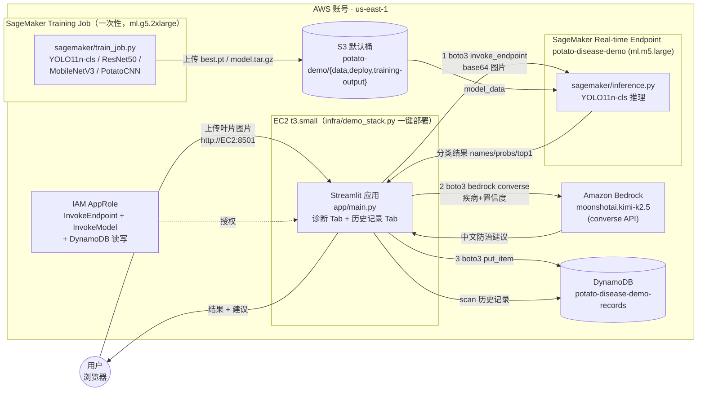
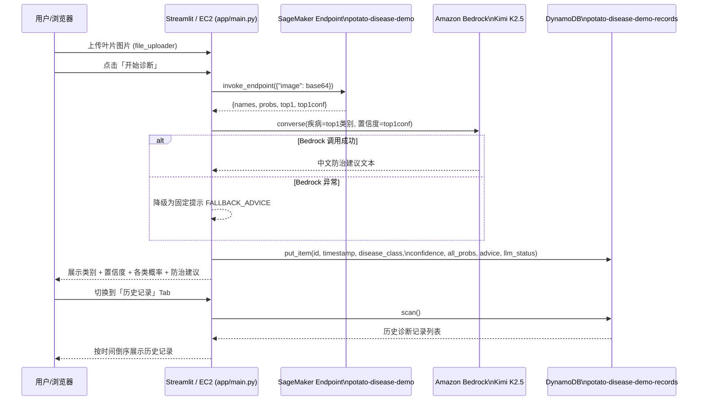

# 架构文档

## 目标

验证一个「计算机视觉分类 + 大语言模型生成建议」的组合应用能否用最少的 AWS 组件跑通端到端流程：上传一张马铃薯叶片照片，由 SageMaker Real-time Endpoint（YOLO11n-cls）完成疾病分类，再由 Amazon Bedrock（Kimi K2.5）生成中文防治建议，最终写入 DynamoDB 形成可回溯的历史记录。

## 组件

- **SageMaker Training Job**（`ml.g5.2xlarge`，一次性）：运行 `sagemaker/train_job.py`，基于 PlantVillage 马铃薯三分类数据集训练并对比 YOLO11n-cls、ResNet50、MobileNetV3、PotatoCNN 四个模型，产出 `best.pt` 等权重文件与 `comparison.json/csv`
- **SageMaker Real-time Endpoint**（`potato-disease-demo`，`ml.m5.large`）：常驻推理端点，加载 YOLO11n-cls (`best.pt`)，由 `sagemaker/inference.py` 提供 `model_fn/input_fn/predict_fn/output_fn` 四个钩子，接收 base64 图片、返回类别与置信度
- **Amazon S3（SageMaker 默认桶）**：存放训练数据（`potato-demo/data/{train,val}`）、打包后的 `model.tar.gz`（`potato-demo/deploy`）以及 Training Job 输出（`potato-demo/training-output`）
- **Amazon Bedrock**：调用第三方模型 `moonshotai.kimi-k2.5`（Kimi K2.5），通过 Bedrock `converse` API 根据分类结果生成中文防治建议
- **Amazon DynamoDB**：`potato-disease-demo-records` 表（按需计费，主键 `id`），记录每次诊断的时间戳、分类结果、置信度、各类别概率、建议文本与 LLM 调用状态
- **Streamlit 前端**（`app/main.py`）：唯一的应用入口，用 `boto3` 直连上述三个服务，提供「诊断」与「历史记录」两个标签页；可跑在 EC2 或 SageMaker Notebook 实例上
- **EC2 + IAM Role（可选，`infra/demo_stack.py`）**：CDK 单栈部署 DynamoDB 表 + EC2 实例（`t3.small`，user-data 自动拉代码起 Streamlit）+ 最小权限 IAM 角色，角色仅授权 `sagemaker:InvokeEndpoint`、`bedrock:InvokeModel`、`dynamodb:PutItem/Scan`
- **`run_pipeline.py`**：一键流水线脚本，串联「打包源码上传 S3 → 提交 Training Job → 创建 Model/EndpointConfig → 更新 Endpoint」

## 架构图

## 训练与推理流程

**训练阶段**：PlantVillage 马铃薯三分类数据集（Early Blight / Healthy / Late Blight）先上传到 SageMaker Notebook 或 S3，`notebooks/train.ipynb` 支持两种路径——有本地 GPU 时在 Notebook 内直接训练（方式 A），无本地 GPU 时提交 SageMaker Training Job 到 `ml.g5.2xlarge`（方式 B）。四个模型（YOLO11n-cls、ResNet50、MobileNetV3、PotatoCNN）同时训练并输出对比表，最终选定 YOLO11n-cls 的 `best.pt` 打包为 `model.tar.gz`，由 `notebooks/deploy.ipynb` 部署为 `ml.m5.large` 的 Real-time Endpoint。

**推理阶段**：用户在 Streamlit 页面上传叶片图片后，前端把图片转 base64 通过 `sagemaker-runtime.invoke_endpoint` 发给 `potato-disease-demo` 端点，`inference.py` 用 YOLO 模型返回类别名称数组、各类别概率、`top1` 索引与置信度；前端据此拼接 Prompt，调用 `bedrock-runtime.converse` 请求 `moonshotai.kimi-k2.5` 生成中文防治建议（若 Bedrock 调用异常，前端会降级返回固定提示文本，不阻断主流程）；随后把分类结果、置信度、各类别概率与建议一并 `put_item` 写入 DynamoDB；「历史记录」标签页则通过 `scan` 读取全部记录并按时间倒序展示。

## 请求路径图

## 关键技术点

- **模型格式**：`sagemaker/inference.py` 直接加载 Ultralytics 的 `YOLO11n-cls`（`best.pt`），推理返回不依赖硬编码类别顺序，而是把 `names` 数组和 `top1` 索引一起返回，调用方按 `names[top1]` 取标签，避免类别顺序不一致导致的误判。
- **Endpoint 选型**：demo 选择 Real-time `ml.m5.large` 而非 Serverless Inference，原因是 Serverless 冷启动叠加 `ultralytics` 重依赖，首次调用可能耗时十几秒到分钟级，不适合现场演示；Real-time 常驻、延迟稳定在约 0.11s/张，演示结束后 `delete-endpoint` 即可停止计费。
- **依赖坑点**（详见 `docs/testing.md`）：SageMaker 无头容器缺 `libGL.so.1`，`sagemaker/requirements.txt` 必须用 `opencv-python-headless`；PyTorch 2.1+ 深度学习容器需用 `cu121` 版本；`ultralytics` 曾将 `numpy` 升级到 2.x 与容器内 `torch` 不兼容，需锁定 `numpy<2` 及 `ultralytics==8.3.135`。
- **Bedrock 调用方式与降级**：前端通过 `bedrock-runtime.converse` 调用第三方模型 `moonshotai.kimi-k2.5`（而非 `invoke_model` 原始接口），需提前在 Bedrock 控制台开通该模型访问权限；`advise()` 函数捕获调用异常并返回固定文案 `FALLBACK_ADVICE`，确保 LLM 不可用时分类结果仍能正常记录，不阻断主流程。
- **IAM 最小权限**：无论前端跑在 EC2 还是 SageMaker Notebook，只需一个角色即可，权限精确到具体 Endpoint ARN、具体 Bedrock 模型 ARN 和具体 DynamoDB 表 ARN 三条语句（见 `infra/demo_stack.py` 中的 `AppRole`），不做过度授权。
